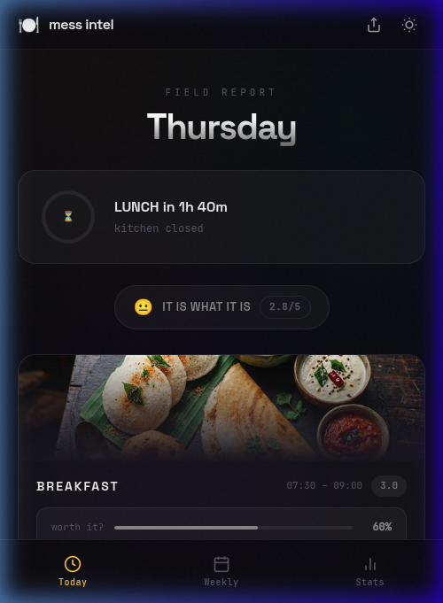

<div align="center">

# 🍽️ Mess Intel — Weekly Survival Guide

**Your hostel mess menu, decoded. Know before you go.**

[](https://safal-mess.vercel.app)
[](https://developer.mozilla.org/en-US/docs/Web/JavaScript)
[](https://web.dev/progressive-web-apps/)
[](https://vercel.com)

<br/>



<br/>

*A premium, dark-themed Progressive Web App that transforms a boring hostel mess menu into an interactive, rating-powered dashboard. Built for the Boys' Hostel Mess at Safal, with vibes-based ratings and zero dependencies.*

</div>

---

## 🎯 What This Does

Mess Intel takes the weekly mess menu and turns it into a modern, interactive dashboard. Instead of squinting at a printed chart on the wall, you get:

- **Real-time meal tracking** — see what's being served right now or when the next meal starts
- **Vibes-based ratings** — every dish rated 1–5 stars, fully customizable per user
- **Daily verdicts** — from 💀 *ABORT MISSION* to 🔥 *LEGENDARY*, so you know whether to walk to the mess or order in
- **Weekly analytics** — bar charts, donut charts, best/worst day, GOAT dish, and more
- **Offline-first PWA** — works without internet once loaded, installable on mobile

---

## ✨ Features

### 📍 Today View
- **Live countdown ring** — shows elapsed time for the current meal or countdown to the next one
- **Meal cards with hero images** — beautiful AI-generated food images per meal type
- **Worth-it meter** — a visual bar showing how "worth going" each meal is
- **Hero dish highlight** — top-rated dish gets a 👑 crown badge
- **Tap-to-rate stars** — click any dish to rate it 1–5 stars, saved to localStorage

### 📅 Weekly View
- **7-day overview** — all days at a glance with emoji verdicts and scores
- **Expandable day cards** — tap any day to reveal full Breakfast / Lunch / High Tea / Dinner menus
- **Inline star ratings** — rate dishes for any day, not just today

### 📊 Stats View (Weekly Debrief)
- **Daily averages bar chart** — visual comparison of all 7 days
- **Rating distribution donut chart** — breakdown of all ★1–★5 ratings across the week
- **Highlights section** — best day 🏆, worst day 💀, GOAT dish 👑, weekly average 📊, bussin days 🍽️, rated items count ⭐

### 🌗 Theme Toggle
- **Dark mode** — deep space black with glassmorphism cards, gradient mesh background, noise overlay
- **Light mode** — warm paper-like tones with soft shadows
- Persisted across sessions via `localStorage`

### 📤 Share
- **Native share / WhatsApp** — exports today's menu with star ratings as formatted text
- Falls back to WhatsApp if Web Share API is not available

### 📱 PWA & Offline
- **Installable** — add to home screen on Android/iOS for a native app experience
- **Service Worker** — caches all assets for offline access
- **Responsive** — mobile-first design, works on any screen size

---

## 🏗️ Project Architecture

```
Mess Dashboard/
├── index.html          # Entry point — semantic HTML5 with PWA meta tags
├── style.css           # Design system — 1,200+ lines, dark/light themes
├── app.js              # Application logic — 930+ lines, menu data + views
├── sw.js               # Service Worker — offline caching strategy
├── manifest.json       # PWA manifest — app name, icons, theme
├── vercel.json         # Vercel deployment configuration
├── package.json        # Dependencies (Vercel Speed Insights)
├── .gitignore          # Excluded files
├── assets/
│   └── food/           # AI-generated food images
│       ├── breakfast.png
│       ├── curry.png
│       ├── biryani.png
│       ├── snacks.png
│       ├── dessert.png
│       ├── dal.png
│       ├── roti.png
│       └── beverages.png
└── README.md           # You're reading this
```

---

## 🛠️ Tech Stack

| Layer | Technology | Purpose |
|-------|-----------|---------|
| **Structure** | HTML5 | Semantic markup, PWA meta tags, Open Graph |
| **Styling** | Vanilla CSS | Design system with CSS custom properties, glassmorphism, animations |
| **Logic** | Vanilla JavaScript | SPA router, dynamic rendering, localStorage ratings |
| **Fonts** | Google Fonts | Space Grotesk (display), Inter (body), JetBrains Mono (monospace) |
| **PWA** | Service Worker + Manifest | Offline caching, installability |
| **Hosting** | Vercel | Auto-deploy from GitHub, Analytics, Speed Insights |
| **Analytics** | Vercel Analytics + Speed Insights | Performance monitoring |

> **Zero dependencies.** No React. No Tailwind. No webpack. Just clean, hand-crafted code.

---

## 🎨 Design System

The app uses a comprehensive design token system defined in CSS custom properties:

### Theme Tokens
```css
/* Dark Mode */
--bg-primary: #0a0a0f;
--bg-card: rgba(255, 255, 255, 0.035);
--text-primary: #f0f0f0;

/* Light Mode */
--bg-primary: #f5f5f0;
--bg-card: rgba(0, 0, 0, 0.03);
--text-primary: #1a1a1a;
```

### Rating Tier System
| Rating | Color | Label |
|--------|-------|-------|
| ★ 1.0–1.5 | 🔴 `#ff3b3b` | ABORT MISSION |
| ★ 1.5–2.5 | 🟠 `#ff8c00` | SURVIVAL MODE |
| ★ 2.5–3.2 | ⚪ `#888888` | IT IS WHAT IT IS |
| ★ 3.2–4.2 | 🟢 `#34d399` | ACTUALLY DECENT |
| ★ 4.2–5.0 | 🟡 `#fbbf24` | LEGENDARY |

### Key Design Elements
- **Glassmorphism** — `backdrop-filter: blur(20px)` on cards and navigation
- **Gradient mesh background** — subtle radial gradients for depth
- **Noise overlay** — SVG noise texture at 2% opacity for organic feel
- **Micro-animations** — `cubic-bezier(0.16, 1, 0.3, 1)` easing throughout
- **Star pop animation** — bouncy feedback on rating tap

---

## 🍛 Menu Data Structure

The menu is hardcoded in `app.js` as a structured `MENU` object, sourced directly from the official **Boys' Hostel Mess Menu** chart:

```javascript
const MENU = {
  monday: {
    breakfast: [
      { name: 'Idli & Vada', rating: 4 },
      { name: 'Sambhar', rating: 3 },
      // ...
    ],
    lunch: [ /* ... */ ],
    highTea: [ /* ... */ ],
    dinner: [ /* ... */ ],
  },
  // tuesday through sunday...
};
```

### Meal Timings
| Meal | Timing | Counter Closing |
|------|--------|-----------------|
| **Breakfast** | 07:30 AM – 09:30 AM | 09:30 AM |
| **Lunch** | 12:15 PM – 02:30 PM | 02:30 PM |
| **Snacks** | 05:15 PM – 06:15 PM | 06:15 PM |
| **Dinner** | 07:15 PM – 09:30 PM | 09:30 PM |

---

## 🚀 Getting Started

### Run Locally

No build step required. Just open the file in a browser:

```bash
# Option 1: Direct open
open index.html

# Option 2: Local server (recommended for PWA/Service Worker)
npx serve .

# Option 3: Python
python3 -m http.server 8000

# Option 4: PHP
php -S localhost:8000
```

> ⚠️ Service Workers require HTTPS or `localhost`. Opening `index.html` via `file://` will disable PWA features.

### Deploy on Vercel

The project is pre-configured for Vercel via `vercel.json`:

```json
{
  "buildCommand": "",
  "outputDirectory": "."
}
```

**Steps:**
1. Push to a GitHub repository
2. Import the repository on [vercel.com](https://vercel.com)
3. Deploy — no configuration needed
4. Auto-deploys on every `git push` to `main`

**Live at:** [safal-mess.vercel.app](https://safal-mess.vercel.app)

---

## 📱 PWA Installation

### Android
1. Visit [safal-mess.vercel.app](https://safal-mess.vercel.app) in Chrome
2. Tap the **"Add to Home Screen"** prompt or go to ⋮ Menu → **Install App**
3. The app installs as a standalone app with no browser chrome

### iOS (Safari)
1. Visit the site in Safari
2. Tap the **Share** button → **Add to Home Screen**
3. Tap **Add**

---

## 🔧 Customization

### Updating the Menu

Edit the `MENU` object in `app.js` (starts at line 38). Each day contains four meals, each meal is an array of items:

```javascript
{ name: 'Dish Name', rating: 3 }  // rating = default vibes score (1-5)
```

### Changing Meal Timings

Edit the `MEAL_TIMES` constant in `app.js`:

```javascript
const MEAL_TIMES = {
  breakfast: { label: 'BREAKFAST', time: '07:30 – 09:30', start: 7.5, end: 9.5 },
  lunch:     { label: 'LUNCH',     time: '12:15 – 14:30', start: 12.25, end: 14.5 },
  highTea:   { label: 'SNACKS',    time: '17:15 – 18:15', start: 17.25, end: 18.25 },
  dinner:    { label: 'DINNER',    time: '19:15 – 21:30', start: 19.25, end: 21.5 },
};
```

### Adding Food Images

Drop new images into `assets/food/` and update the `FOOD_IMAGES` or `CATEGORY_IMAGES` mappings in `app.js`.

---

## 📊 How Ratings Work

1. **Default ratings** are baked into the `MENU` data as initial "vibes-based" scores
2. **User ratings** override defaults when a user taps a star — saved to `localStorage`
3. **Averages** are calculated per-meal and per-day to generate verdicts
4. **Verdicts** are computed from rating thresholds (see [Rating Tier System](#rating-tier-system))
5. All ratings persist across sessions but are **local to each device**

---

## 📈 Analytics

The app integrates Vercel's analytics suite:

- **Vercel Analytics** — page views, unique visitors, geographic data
- **Vercel Speed Insights** — Core Web Vitals (LCP, FID, CLS)

Both are injected via Vercel's auto-injected scripts and require no configuration.

---

## 📂 File Details

| File | Lines | Size | Description |
|------|-------|------|-------------|
| `app.js` | 930 | 32 KB | Menu data, SPA router, view rendering, rating logic, share functionality |
| `style.css` | 1,216 | 22 KB | Complete design system: themes, components, animations, responsive layout |
| `index.html` | 134 | 6 KB | Semantic HTML5 shell with PWA meta, Open Graph, font loading |
| `sw.js` | 39 | 1 KB | Service Worker: install, activate, fetch with cache-first strategy |
| `manifest.json` | 18 | 1 KB | PWA manifest: app identity, display mode, theme |
| `vercel.json` | 4 | 51 B | Vercel deployment config: static site, root output directory |

**Total:** ~2,340 lines of hand-written code

---

## 🤝 Contributing

1. Fork the repository
2. Create a feature branch (`git checkout -b feature/amazing-feature`)
3. Commit your changes (`git commit -m 'feat: add amazing feature'`)
4. Push to the branch (`git push origin feature/amazing-feature`)
5. Open a Pull Request

---

## 📜 License

This project is open source and available under the [MIT License](LICENSE).

---

<div align="center">

**Built with ☕ and questionable mess food opinions.**

[Live Site](https://safal-mess.vercel.app) · [Report Bug](https://github.com/Tribal-Chief-001/Mess-Dashboard/issues) · [Request Feature](https://github.com/Tribal-Chief-001/Mess-Dashboard/issues)

</div>
